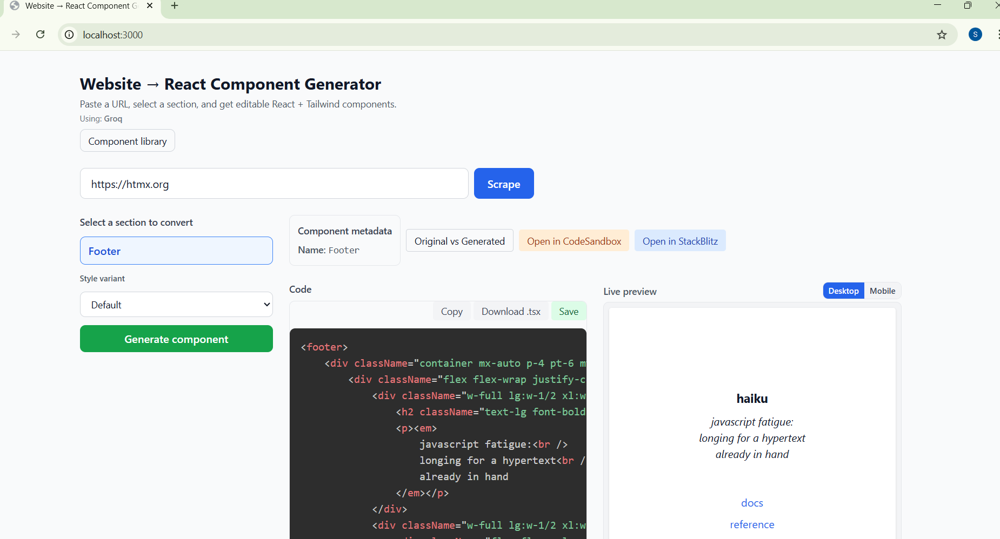
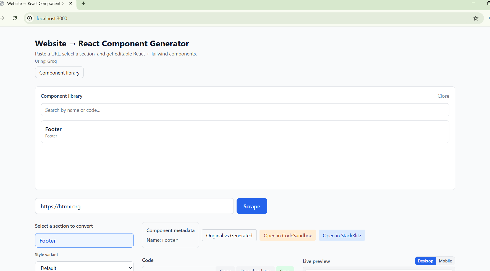

# Website → React Component Generator

**Paste a website URL → get editable React + Tailwind components.**

A production-grade tool that scrapes real websites, detects sections, and uses **Groq, Claude, or Google Gemini** to convert selected sections into clean React + Tailwind components. Includes live preview and chat-style refinement. **Use Groq for free (no credit card)** at [console.groq.com](https://console.groq.com); or Gemini/Claude if you prefer.

---

## What This Does

1. **Paste a URL** – Public website (e.g. a landing page).
2. **Scrape** – Server fetches the page and extracts HTML, linked CSS, and image URLs.
3. **Detect sections** – Heuristic detection (semantic tags + headings) surfaces Hero, Features, Pricing, etc.
4. **Select a section** – You choose which part to convert.
5. **Generate** – Groq, Claude, or Gemini produces a single React (TSX) component using **Tailwind only**.
6. **Preview** – Code on the left, live preview on the right (isolated iframe).
7. **Refine** – Chat-style instructions: “Make it darker”, “Increase spacing”, “Use Inter font”.

---

## Tech Stack

| Layer   | Choice                    |
|--------|---------------------------|
| App    | Next.js 14 (App Router), React 18, TypeScript |
| Styling| Tailwind CSS              |
| Scraping | Cheerio + fetch (server-side) |
| AI     | **Groq (free, no card)** or Claude or Gemini |
| Preview| iframe + Babel standalone + React 18 UMD |
| Code display | Prism.js (TSX)     |

---

## Architecture

```
User → URL input → POST /api/scrape → HTML + styles + images
     → POST /api/sections → [{ id, label, html }]
     → User selects section → POST /api/generate → { code }
     → Code panel + Live preview (iframe)
     → Refinement chat → POST /api/refine → { code } → update state
```

- **Scraping:** `src/lib/scrape.ts` – fetch + Cheerio; extracts HTML, `<link rel="stylesheet">`, `<style>`, ``.
- **Sections:** `src/lib/sections.ts` – splits by `<section>`, `<header>`, `<main>`, etc., and by headings; labels from keywords (Hero, Pricing, …).
- **Generate/Refine:** `src/lib/prompts.ts` + `src/lib/ai.ts` – system prompts enforce React + Tailwind only; **AI provider**: Groq (free), Claude, or Gemini. Set `GROQ_API_KEY` (recommended), or `ANTHROPIC_API_KEY`, or `GOOGLE_GENERATIVE_AI_API_KEY` in `.env.local`.
- **Preview:** `/preview` page loads in iframe; receives code via `postMessage`; Babel transforms JSX; eval in scope with React; errors shown inside iframe so the main app never crashes.

---

## How to Run

1. **Clone and install**

   ```bash
   cd ecomcoder
   npm install
   ```

2. **Environment (pick one — no credit card needed for Groq)**

   Copy `.env.local.example` to `.env.local` and add **one** API key:

   - **Free, no credit card:** Get a Groq API key at [console.groq.com](https://console.groq.com) (sign up with email or GitHub). Set `GROQ_API_KEY=your_key` in `.env.local`.
   - **Free (quota varies by region):** Gemini at [Google AI Studio](https://aistudio.google.com/app/apikey). Set `GOOGLE_GENERATIVE_AI_API_KEY=your_key`.
   - **Paid:** Set `ANTHROPIC_API_KEY=sk-ant-...` for Claude.

3. **Dev server**

   ```bash
   npm run dev
   ```

   Open [http://localhost:3000](http://localhost:3000), paste a URL, scrape, select a section, generate, and refine as needed.

---

## AI Prompt Strategy

- **Generate:** System prompt instructs Claude to output a single React (TSX) functional component, Tailwind-only styling, semantic/accessible markup, no markdown code fences. User message includes the section HTML and label.
- **Refine:** System prompt asks for the full updated component from current code + user request; output code only. Code is extracted from the response (markdown fences stripped if present).

---

## Scraping: How It Works and Limits

- **Method:** Server-side `fetch` + Cheerio. No headless browser.
- **Works well for:** Static and server-rendered pages (marketing sites, docs, many landing pages).
- **Limitations:**
  - **JS-heavy SPAs** that render content only after client-side JS may return mostly empty or shell HTML. For those, consider adding Playwright/Puppeteer and documenting it as an optional “full browser” mode.
  - **CORS / bot blocking:** Some sites block non-browser requests; we send a clear User-Agent but cannot bypass strict bot protection.
  - **Size:** HTML is capped (~1.2MB); very large pages may be rejected.

---

## Bonus Features

**Level 1**

- **Screenshot fallback:** When scrape fails, the app shows the error plus an “Open URL in new tab” link and an iframe view of the page so you can still see it.
- **Mobile + desktop preview:** Toggle “Desktop” / “Mobile” above the live preview to see the component at full width or 375px.
- **Save locally:** Click “Save” in the code panel to store the current component in the browser (localStorage). Name it and load it later from the library.
- **Export .tsx:** Click “Download .tsx” to download the generated component as a `.tsx` file.

**Level 2**

- **Section comparison (original vs generated):** Click “Original vs Generated” to switch the right panel to tabs: “Original” (scraped HTML) and “Generated” (live preview).
- **Style variants:** Before generating, choose “Default”, “Modern”, or “Minimal” in the “Style variant” dropdown; the AI applies that style.
- **Component metadata:** When code is present, the app shows parsed component name and props (when detectable).

**Level 3**

- **Component library:** Click “Component library” in the header to open a list of saved components. Search by name or code; click to load, or delete.
- **Semantic search:** The library search filters by component name, section label, and code content.
- **One-click deploy:** Use “Open in CodeSandbox” or “Open in StackBlitz” to open the current component in a new tab (CodeSandbox creates a sandbox; StackBlitz opens the React template and copies the code).

---

## Project Structure

```
src/
├── app/
│   ├── layout.tsx, page.tsx, globals.css
│   ├── preview/page.tsx
│   └── api/
│       ├── scrape, sections, generate, refine, provider
├── components/
│   ├── UrlInput, SectionSelector, CodePanel, LivePreview, RefinementChat
│   ├── ScrapeFallback, SectionComparison, ComponentMetadata, ComponentLibrary
├── lib/
│   ├── scrape, sections, prompts, validateUrl, ai, savedComponents, componentMetadata, deploy
└── types/
    └── index.ts
```

---

## Example URLs to Try

- Simple marketing or landing pages (e.g. [tailwindui.com](https://tailwindui.com) components or similar).
- Any public, static or SSR page with clear sections (hero, features, pricing, footer).

Avoid (for best results): login-walled pages, heavy client-only SPAs, or sites that aggressively block scrapers.

---

## No credits? Use Groq (free, no credit card)

If you don’t have Claude or Gemini quota, use **Groq**:

1. Go to [console.groq.com](https://console.groq.com) and sign up (email or GitHub).
2. Create an API key in the dashboard (free tier, no credit card).
3. In `.env.local` set: `GROQ_API_KEY=your_key`.
4. Restart `npm run dev` — generate and refine will use Groq.

The app prefers Groq when `GROQ_API_KEY` is set; then Claude; then Gemini.

---

## Deploy

**Vercel (recommended for Next.js)**

1. Push the repo to GitHub (or GitLab/Bitbucket).
2. Go to [vercel.com](https://vercel.com) and sign in with GitHub.
3. Click **Add New → Project** and import this repo.
4. Leave **Framework Preset** as Next.js and **Root Directory** as `.`; click **Deploy**.
5. After the first deploy, go to **Settings → Environment Variables** and add one of:
   - `GROQ_API_KEY` (free, recommended)
   - `GOOGLE_GENERATIVE_AI_API_KEY` or `GEMINI_API_KEY`
   - `ANTHROPIC_API_KEY`
6. Redeploy (Deployments → ⋮ → Redeploy) so the app picks up the env var.

**From your machine (optional)**

- Install Vercel CLI: `npm i -g vercel`
- In the project folder: `vercel` (follow prompts, then `vercel --prod` for production).

**Netlify**

- Connect the repo at [netlify.com](https://netlify.com). Use the detected Next.js build (`npm run build`). Add env vars in **Site settings → Environment variables**.

---

## Live Demo

**[Add your deployed URL here]** (e.g. `https://website-to-react-generator.vercel.app`)

Works without setup. Add one AI API key in the hosting dashboard (see [How to Run](#how-to-run)).

**Example URLs to test**

- [https://htmx.org](https://htmx.org) – small, clear sections (e.g. Footer).
- [https://tailwindcss.com](https://tailwindcss.com) – larger page; try a section like Hero or Features.
- [https://stripe.com](https://stripe.com) – marketing layout with clear blocks.

---

## Screenshots / Demo

_Add your own screenshots or a short GIF under `docs/` and reference them here._

| Generator (URL → sections → code + preview) | Component library + search |
|--------------------------------------------|----------------------------|
|           |  |

**Demo video (3–5 min):** [Add link to your screen recording here] — URL → scrape → section selection → generation → live preview → refinement → error handling.

---

## Technical Write-up

### What was the hardest part?

The hardest part was **making the live preview reliable** without crashing the app. Generated code can have invalid JSX (e.g. `<br>` instead of `<br />`), missing `export default`, or syntax errors. We had to: (1) run the code in an isolated iframe so failures don’t affect the main app; (2) normalize common issues (e.g. `<br>` → `<br />`) before passing code to Babel; (3) add a fallback so that when the model omits `export default`, we still detect the component (e.g. by parsing `function ComponentName(`) and assign it for rendering. Getting the right balance between “fix in the prompt” and “fix in the preview” took iteration.

### How did you decide component boundaries?

Component boundaries were chosen by **responsibility**: URL + scrape → `UrlInput`; section list + style variant + generate → `SectionSelector`; code display + copy + download + save → `CodePanel`; isolated preview + viewport toggle → `LivePreview`; refinement chat → `RefinementChat`. For **section detection**, boundaries are heuristic: we split on semantic tags (`<section>`, `<header>`, `<main>`, etc.) and on major headings, then label sections (Hero, Pricing, etc.) from keywords. We did not use AI for section boundaries to keep the pipeline fast and deterministic; the AI is used only for HTML → React + Tailwind conversion and refinement.

### What broke, and how did you handle it?

- **Scraping:** Some sites block or timeout. We added a **screenshot fallback**: when scrape fails, we show the error, an “Open URL in new tab” link, and an iframe pointing at the URL so the user can still view the page.
- **AI quota (Gemini):** Free tier often hit rate limits or “quota unavailable”. We added **Groq** as a free, no-credit-card option and made the app prefer Groq when `GROQ_API_KEY` is set.
- **Preview errors:** Invalid JSX (e.g. `<br>`) and missing `export default` caused “Generated code did not export a component” or Babel errors. We **normalize** `<br>` / `<hr>` to self-closing in the preview, **strengthened prompts** to require default export and self-closing void tags, and added a **fallback** that infers the component from `function Name(` when no export is present.
- **Import path on Windows:** A backslash in `@/components\ComponentMetadata` was resolved as one path segment. We fixed the import to use a forward slash: `@/components/ComponentMetadata`.

### How did you use AI in your workflow?

AI is used in two places: (1) **Generate** — the AI converts scraped section HTML into a single React + Tailwind component; (2) **Refine** — the AI takes the current code and the user’s instruction (e.g. “Make it darker”) and returns the full updated component. System prompts enforce: functional React, Tailwind only, no raw CSS, semantic/accessible markup, and code-only output (no markdown fences). We support multiple providers (Groq, Claude, Gemini) so users can choose based on cost and availability.

### What would you improve with more time?

- **Scraping:** Add **Playwright** (or Puppeteer) as an option for JS-heavy SPAs, with a clear “full browser” mode and documented limitations.
- **Section detection:** Optionally use AI to suggest or refine section boundaries and labels for noisy pages.
- **Multi-section export:** Allow selecting multiple sections and generate a single file (or multiple components) with clear boundaries.
- **Deploy flow:** Improve **StackBlitz** integration (e.g. use their run API with project payload instead of “copy + open template”) and add **CodeSandbox** template validation.
- **Component metadata:** Rely on AI or a small parser to extract props/variants and surface them in the library and in export.

---

## Deploy (e.g. Vercel)

1. Push to GitHub and connect the repo to Vercel.
2. Set **one** of `GROQ_API_KEY`, `GOOGLE_GENERATIVE_AI_API_KEY`, or `ANTHROPIC_API_KEY` in the project environment variables.
3. Deploy. The app works without extra setup; scraping runs on the server.

---

## License

MIT.
